A simple but powerful Android app that allows you to create shortcuts and widgets that can be placed on your home screen. Each shortcut, when clicked, triggers an HTTP request, with the possibility of processing and displaying the response in various ways. Ideal for home automation projects.

This app is free and open-source and can be found on [GitHub](https://github.com/Waboodoo/HTTP-Shortcuts).
If you find bugs, have questions or feature requests, feel free to [contact me](https://http-shortcuts.rmy.ch/contact).
Also check out the [official subreddit](https://www.reddit.com/r/HTTP_Shortcuts/) for idea exchange, discussions and news.

If you like this app, please consider [supporting my work](https://http-shortcuts.rmy.ch/support-me) on it. Thank you.

<iframe src="https://github.com/sponsors/Waboodoo/button" title="Sponsor Waboodoo" height="32" width="114" style="border: 0; border-radius: 6px;"></iframe>

## Features
- 100% free
- Open-source
- No ads
- [(Almost) no tracking](privacy-policy.md)
- Runs on Android 8 (Oreo) or newer. See below for older versions.

### Technical
- Supports HTTP and HTTPS (TLSv1.3), and methods GET, POST, PUT, DELETE, PATCH, HEAD, OPTIONS and TRACE
- Basic Authentication, Digest Authentication, Bearer Authentication and Client Certificate Authentication
- Custom request headers
- Custom request body (text based, from static file, file picker, static, or camera)
- Upload files as form-data parameters
- Support for self-signed certificates & Certificate Pinning
- Import from and export to cURL commands

### Customization
- Display responses as a toast, fullscreen window, dialog window, notification, or run silently
- Store response into a file
- Big set of colorful built-in icons, support for custom icons
- Value injection through [local and global variables](variables.md) with dynamically determined values (e.g., text, numbers, passwords, selections, colors, dates, …)
- Run arbitrary [JavaScript](scripting.md) before & after execution, which allows for lots of customization with features such as:
  - compute values such as timestamps, random numbers, UUIDs, hashes, HMACs, base64, etc.
  - parse JSON, HTML or XML and extract data from it
  - show toast message or message dialogs
  - vibrate or play notification sounds
  - read and write files
  - trigger other shortcuts to chain multiple HTTP requests 
  - interact with other devices and services by sending TCP or UDP packets, MQTT messages or using Wake-on-LAN

### Quality of Life
- Dark Mode support
- Keep everything organized by categorizing into different [tabs and grouping into sections](categories.md)
- Import & Export all data as a ZIP file
  - Optionally password protected
  - Manually or automatically to a local file or web server
- Configure it from your browser using the [Web Editor](https://http-shortcuts.rmy.ch/editor) 

### And More
- Display variable values in widgets on your home screen
- Integrations with 3rd-party apps, for example:
  - [Tasker](dvanced.md#integrate-with-tasker)
  - [MacroDroid](advanced.md#integrate-with-macrodroid)
  - [Termux](scripting.md#run-termux-command)
  - [Wireguard](scripting.md#set-wireguard-tunnel-state)
  - [QR Code Scanners](scripting.md#scan-barcode)
- Support for non-HTTP use-cases:
  - [Browser Shortcuts](shortcuts.md#browser-shortcut) allow opening a URL in a browser or custom tab
  - [MQTT Shortcuts](shortcuts.md#mqtt-shortcut) allow sending MQTT messages
  - [Wake-on-LAN Shortcuts](shortcuts.md#wake-on-lan) allow waking up a device on the network
  - [Scripting Shortcuts](shortcuts.md#scripting-shortcut) allow defining custom logic using JavaScript code, with a large set of built-in functions

## Screenshots
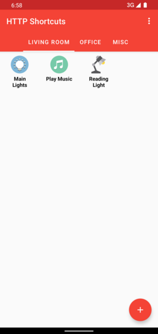
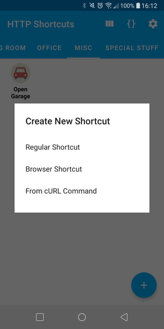
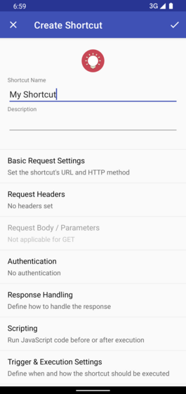
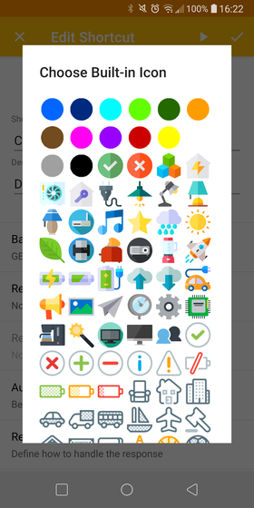
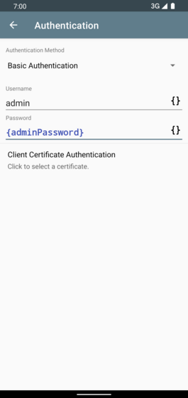
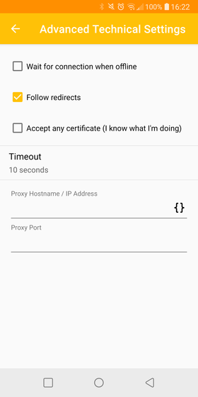
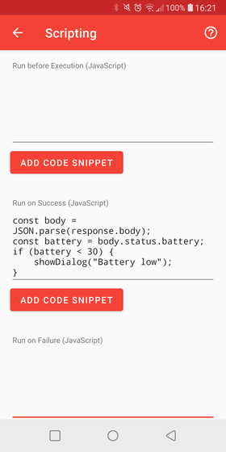
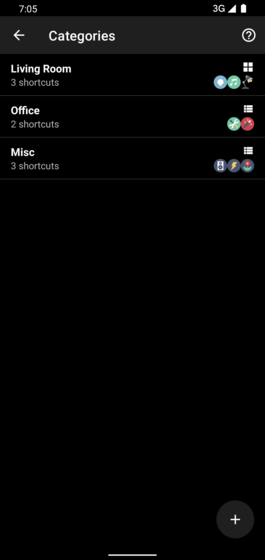
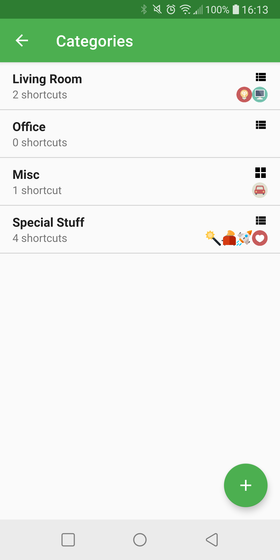
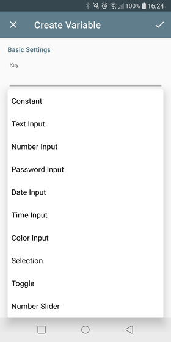
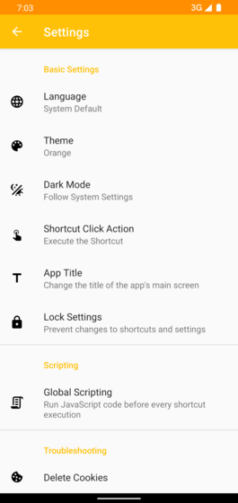
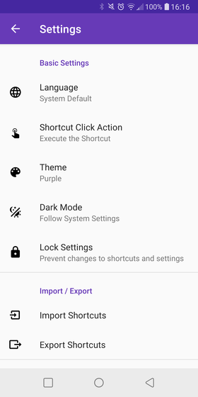
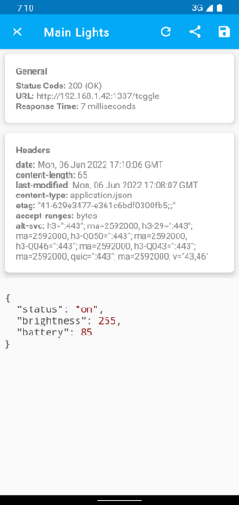

## Support for Older Android Versions
- For Android 6 or 7, download and [install the APK of version 3.21.0](https://github.com/Waboodoo/HTTP-Shortcuts/releases/tag/v3.21.0).
- For Android 5, download and [install the APK of version 3.14.0](https://github.com/Waboodoo/HTTP-Shortcuts/releases/tag/v3.14.0).
- For Android 4.0 - Android 4.4.4, download and [install the APK of version 2.9.0](https://github.com/Waboodoo/HTTP-Shortcuts/releases/tag/v2.9.0).
