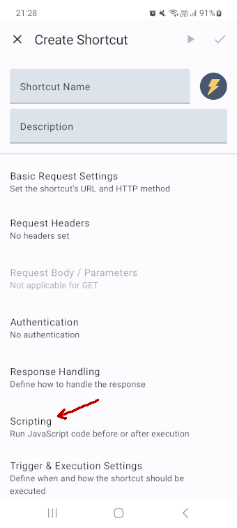

<a name="scripting"></a>
# Scripting

When a shortcut is executed it is possible to run JavaScript code snippets before or after execution. You'll find the corresponding settings in the shortcut editor in the *"Scripting"* section.




Additionally, you'll find an option in the app's settings (labeled "Global Scripting") that allows you to run code before the execution of every shortcut, which can be used to define shared functions.

Most of [JavaScript's built-in functionalities](https://developer.mozilla.org/en-US/docs/Web/JavaScript/Reference) can be used normally, e.g., to manipulate [Strings](https://developer.mozilla.org/en-US/docs/Web/JavaScript/Reference/Global_Objects/String) or [Arrays](https://developer.mozilla.org/en-US/docs/Web/JavaScript/Reference/Global_Objects/Array). Additionally, the app has some functions and utilities built in for convenience, all of which are documented below.

Using these code blocks, there are a number of things you can achieve. See the [examples](#examples) below for inspiration.

**Pro-tip:** Writing code on a phone is tedious. If you're intending to write longer blocks of code, I recommend you check out the [Web Editor](https://http-shortcuts.rmy.ch/editor/) for more convenient configuration of your shortcuts.

<a name="handle-response"></a>
## Handling the Response

You can access the response of your HTTP request via the `response` object.

> Please note that the `response` object is only available in the *"Run on Success"* code block, as well as in the *"Run on Failure"* code block in case there was an HTTP response (i.e., a status code of 4xx or 5xx), and will otherwise be `null`.

### Getting the Response Body

The response body is available as a string via `response.body`.

```js
const myBody = response.body;
```

If you know that the response body is in JSON format, you can use `JSON.parse()` to turn it into a JS object, array or primitive.

```js
const myJson = JSON.parse(response.body);
```

<a name="response-headers"></a>
### Getting Response Headers

The response headers are available as an object (key-value-pairs) via `response.headers`. Each key corresponds to the name of the header and its value is an array of strings of all the headers with that name.

There is also a convenience function `response.getHeader(name)` which can be used to get the value of a specific header by its name. If there are multiple headers with that name, the last one is returned, and if there are none, `null` is returned.

```js
const contentType = response.headers['Content-Type'][0];

const contentLength = response.getHeader('Content-Length');
```

<a name="response-status"></a>
### Getting the Status Code

The response's HTTP status code is available as an integer via `response.statusCode`.

```js
const isNotFound = response.statusCode == 404;
```

<a name="response-cookies"></a>
### Getting Cookies

The response's cookies are available as an object (key-value-pairs) via `response.cookies`. Each key corresponds to the name of the cookie and its value is an array of strings of all the cookies with that name.

There is also a convenience function `response.getCookie(name)` which can be used to get the value of a specific cookie by its name. If there are multiple cookies with that name, the last one is returned, and if there are none, `null` is returned.

```js
const myCookieValue = response.cookies['MyCookieName'][0];

const myCookieValue2 = response.getCookie('MyCookieName2');
```

If you need more details about a cookie (e.g. its expiration timestamp) you can use `response.headers['Set-Cookie']` to read out the cookie headers directly.

<a name="response-errors"></a>
### Errors

Please note that the `response` object will be `null` if there was no response from the server, i.e., in case of a network error. In that case, you can inspect the `networkError` to get a string describing the error.

<a name="variables"></a>
## Reading & Writing Variables

In the app you can create [global variables](variables) to be used in your shortcuts, e.g. to dynamically insert values for a URL, a query parameter or part of the request body. You'll find the variable editor via the "Variables" option in the menu in the app's main screen.

This section explains how you can interact with these variables from a script.

<a name="get-variable"></a>
### getVariable

You can access the value of any of your variables via the `getVariable()` function. Simply pass the variable's name or ID as a parameter.

```js
const myValue = getVariable('myVariable');
```

> Please note that the returned value will always be a string. If the variable does not exist an error is raised.

<a name="set-variable"></a>
### setVariable

You can store a value as a string into a variable via the `setVariable()` function. Simply pass the variable's name or ID as the first parameter and the value you want to store as the second parameter.

```js
setVariable('myVariable', 'Hello World');
```

> Please note that there is a size limit of 30'000 characters. If you set a value larger than that, it will be used unaltered for the current execution, but the value that is stored will be truncated.

> If the variable does not exist an error is raised.

As an optional third parameter you can pass a boolean. If it is `true`, the new value will be stored but not used immediately for the current execution. This is useful for variable types which support the 'Remember value' feature (such as Date Input, Time Input, Text Input, etc.) as it allows to change the stored previous value which is used as the default selected value.

```js
setVariable('myVariable', 'Hello World', true); // only changes the stored value, but variable will still resolve normally if used afterwards
```

<a name="shortcut-info"></a>
## Getting Information about the Current Shortcut

You can easily retrieve information about the current shortcut and the category it belongs to from the `shortcut` object. This includes the shortcut's ID, name, description and whether it is hidden, as well as its category's ID and name.

```js
shortcut.id;
shortcut.name;
shortcut.description;
shortcut.hidden;
shortcut.category.id;
shortcut.category.name;
```


<a name="files"></a>
## Files

### Selected Files

If your shortcut makes use of file parameters or uses the content of a file as the request body then you can access information about these files using the `selectedFiles` array. Each selected file has an entry, allowing you to read out its file name, size (in bytes), media type and potentially some additional meta information.


```js
const numberOfFiles = selectedFiles.length;

selectedFiles[0].name;
selectedFiles[0].size; // AFTER cropping/rotating
selectedFiles[0].type;
selectedFiles[0].meta;
```

Each file also has a unique ID, which is currently only useful if you want to forward these files to another shortcut using the [`enqueueShortcut`](#trigger-shortcut) function.

```js
selectedFiles[0].id;

const allFileIds = selectedFiles.map(file => file.id);
```

The `meta` field currently only provides information about images and is otherwise an empty object. It allows to read out an image's orientation and the timestamp of when it was created (in "yyyy-MM-dd HH:mm:ss" format):

```js
const myMeta = selectedFiles[0].meta;

/*
myMeta might look like this now:
{
  'created': '2022-12-31 23:59:59',
  'orientation': 1,
}
*/
```

The `orientation` field is an integer with the following meaning:

- 0 means no orientation information is available
- 1 means a rotation of 0 degrees, i.e., no adjument is needed
- 2 means a rotation of 0 degrees, and the image is mirrored
- 3 means a rotation of 180 degrees
- 4 means a rotation of 180 degrees, and the image is mirrored
- 5 means a rotation of 90 degrees
- 6 means a rotation of 90 degrees, and the image is mirrored
- 7 means a rotation of 270 degrees
- 8 means a rotation of 270 degrees, and the image is mirrored


<a name="read-write-files"></a>
### Reading and Writing Files

If you want to read from an existing file or write data to a file, you first need to mount the directory which contains the file. This can be done via the ["(Mounted) Directories screen](directories.md). Once you have a mounted directory, you can use the `getDirectory()` function to get a handle to it. Pass the name of the mounted directory as the first parameter. This handle then lets you read and write files, using the `readFile()` and `writeFile()` functions.

For `readFiles()`, pass the name or path of the file you wish to read from as the first parameter, relative to the mounted directory. The file must exist, otherwise an error is raised. As an optional second parameter, you can pass the encoding that should be used to read the file, which defaults to UTF-8. The file's entire content is returned as a string.

```js
const dir = getDirectory('myMountedDirectory');
const fileContent = dir.readFile('someDir/someFile.txt');
```

For `writeFiles()`, pass the name or path of the file you wish to write to as the first parameter, relative to the mounted directory. If the file or a directory along its path does not yet exist, it is automatically created.

> If the file already exists, its contents will be replaced without warning!

As the second parameter, pass the content you wish to write into the file.

```js
const dir = getDirectory('myMountedDirectory');
dir.writeFile('someFile.txt', 'New file content');
```

<a name="user-interaction"></a>
## User Interaction

This section describes how you can interact with the user (i.e., you), during the execution of a shortcut, e.g., to ask for additional input, to confirm an action or to display information.

<a name="show-toast"></a>
### showToast

With this function you can display a toast message on the screen. Simply pass your message as the first parameter.

```js
showToast('Hello World');
```

> Please note that no toast will be displayed if the string you pass is empty. Also note that a toast will show at most two lines of text, so it is best suited for short messages.

<a name="show-dialog"></a>
### showDialog

With this function you can display a dialog window on the screen. Simply pass your message as the first parameter, and optionally a title for the dialog as the second paramter. The dialog will be displayed until its *"OK"* button is pressed.

```js
showDialog('My Message', 'My Title');

showDialog('You can also use <b>basic</b> <i>HTML</i> for formatting the message.');
```

> Please note that no dialog will be displayed if the string you pass is empty.

<a name="prompt-confirm"></a>
### prompt, confirm

Similar to how JavaScript works in a browser, you can use `prompt()` and `confirm()` to ask the user for input as part of a workflow.

`prompt()` will open a dialog window asking for text input. The entered text is then returned as a string. If the dialog is cancelled, `null` is returned instead. Pass a message in as the first parameter, and optionally a second parameter to prefill the text input field.

`confirm()` will open a confirmation dialog. It returns true if the dialog is confirmed, or false if it is cancelled. Pass a message in as the first parameter.

```js
if (confirm('Are you sure?')) {
  // Do something only if the user clicked 'OK'
}
```

```js
const myName = prompt('What is your name?');
```

<a name="prompt-number"></a>
### promptNumber

You can use the `promptNumber`function to open an input dialog that asks for a number. The entered number will be the return value, or `null` if the dialog is cancelled. If the entered value is not a valid number `NaN` will be returned.

As the first parameter pass the text to display on the dialog. This must not be empty. As an optional second parameter you may pass a default value which is used to prefill the input field.

```js
const myNumber = promptNumber('What is your favorite number?', 42);
```

<a name="prompt-password"></a>
### promptPassword

The `promptPassword()` function opens a text input dialog that asks for a password. The entered password is then returned, or `null` if the dialog is cancelled. Pass a message in as the first parameter, and optionally a second parameter to prefill the text input field.

```js
const myPassword = promptPassword("Please enter your password:");
const myPassword2 = promptPassword("Please enter your password:", "secret123");
```

<a name="prompt-color"></a>
### promptColor

The `promptColor()` function opens a color picker. The selected color is returned in hex RGB (e.g. FF0000 for red), or `null` if the picker is cancelled. As an optional parameter you can pass in the preselected color.

```js
const myColor = promptColor();
const myColor2 = promptColor("#FF0000");
```

<a name="prompt-date"></a>
### promptDate

The `promptDate()` function opens a date picker. The selected date is returned, or `null` if the picker is cancelled. As the first parameter, you may pass the date format that should be used for the return value (defaults to yyyy-MM-dd), and as a second parameter you may pass the preselected date (in yyyy-MM-dd format).

```js
const myDate = promptDate();
const myDate2 = promptDate("yyyy-MM-dd", "2050-12-31");
```

<a name="prompt-time"></a>
### promptTime

The `promptTime()` function opens a time picker. The selected time is returned, or `null` if the picker is cancelled. As the first parameter, you may pass the time format that should be used for the return value (defaults to HH:mm), and as a second parameter you may pass the preselected time (in HH:mm format).

```js
const myTime = promptTime();
const myTime2 = promptTime("HH/mm", "13:37");
```

<a name="show-selection"></a>
### showSelection

This function allows you to display a multiple-choice dialog from which an option can be picked. It takes one argument, which must be either an object consisting of key-value string pairs, or a list of strings. It returns the selected value as a string, or `null` if the dialog is closed without a selection (e.g. by pressing the back button).

```js
// Using an array of strings
const starterPokemon = showSelection(['Bulbasaur', 'Charmander', 'Squirtle']);

// Using an object
const favoriteColor = showSelection({
  '#ff0000': 'Red',
  '#00ff00': 'Green',
  '#0000ff': 'Blue',
});
```

<a name="play-sound"></a>
### playSound

With this function you can play a notification sound. If no argument is passed, it will use the system's default notification sound. You can use the Code Snippet picker inside the app to select a different sound.

```js
playSound();
```

<a name="speak"></a>
### speak

With this function you can have a piece of text be read out loud, using the device's text-to-speech engine. Simply pass the text you want to read as the first parameter, and optionally a language identifier as the second parameter.

> Please note that only the first 400 characters will be read. Please also note that the second parameter is ignored if the language is not supported.

```js
speak('Hello World');

speak('Dieser Text ist deutsch', 'de');
```

> This function may not be supported by all devices.

<a name="vibrate"></a>
### vibrate

With this function you can cause the device to vibrate (if supported). As an optional first parameter, you can pass the number of the vibration pattern you want to use, and as an optional second paramter you can pass a boolean denoting whether the execution should wait for the vibration pattern to finish or not.

Vibration patterns:

- 1 means *"1 short vibration"*
- 2 means *"1 long vibration"*
- 3 means *"3 short vibrations"*

```js
vibrate(2, true);
```

<a name="scan-barcode"></a>
### scanBarcode

The `scanBarcode` function lets you scan a barcode (e.g. a QR code). On success the function returns the raw data of the barcode as a string. If the scanner is cancelled, `null` is returned instead.

```js
const code = scanBarcode();
```

The scanning itself is done by an external app, specifically either [QR Droid](https://play.google.com/store/apps/details?id=la.droid.qr), [Barcode Scanner](https://play.google.com/store/apps/details?id=com.google.zxing.client.android) or [Binary Eye](https://play.google.com/store/apps/details?id=de.markusfisch.android.binaryeye), which means you need to have that app installed for this function to work. This also means that the HTTP Shortcuts app itself will not need access to your camera directly.

<a name="modify-shortcuts"></a>
## Modify Shortcuts

This section lists all the built-in functions which you can use to modify existing shortcuts programmatically.

<a name="rename-shortcut"></a>
### renameShortcut

With this function you can rename a shortcut. Simply pass the name or ID of a shortcut as the first parameter and the new name as the second one. You can also pass an empty string as the first parameter to target the current shortcut.

```js
renameShortcut('Old Name', 'New Name');
```

<a name="change-description"></a>
### changeDescription

With this function you can change the description of a shortcut. Simply pass the name or ID of a shortcut as the first parameter and the new description as the second one. You can also pass an empty string as the first parameter to target the current shortcut.

```js
changeDescription('My Shortcut', 'New Description');
```

> A shortcut's description is only visible in categories that use a list layout, not in those that use a grid layout.

<a name="change-icon"></a>
### changeIcon

With this function you can change the icon of a shortcut. Simply pass the name or ID of a shortcut as the first parameter and the name of the icon as the second one. You can also pass an empty string as the first parameter to target the current shortcut. Use the *"Add Code Snippet"* button in the app to select an icon. Alternatively, you can check the [source code](https://github.com/Waboodoo/HTTP-Shortcuts/blob/develop/HTTPShortcuts/app/src/main/kotlin/ch/rmy/android/http_shortcuts/icons/Icons.kt) for all the available icons names (look for the prefix "R.drawable.", everything after it is a valid icon name).

```js
changeIcon('My Shortcut', 'bitsies_lightbulb');
```

<a name="set-shortcut-hidden"></a>
### setShortcutHidden

This function allows you to show or hide individual shortcuts inside the app. Simply pass the name or ID of a shortcut as the first parameter and `true` or `false` as the second parameter. You can also pass an empty string as the first parameter to target the current shortcut.

```js
setShortcutHidden('My Shortcut', true);
```

> You can make hidden shortcuts visible via an option on the Settings screen.

<a name="control-flow"></a>
## Control Flow

This section lists some of the options you have to control the execution flow of your script.

<a name="wait"></a>
### wait

The `wait` function allows you to delay execution by waiting (also called sleeping) for a specified number of milliseconds before continuing with the execution of the script.

```js
wait(3000); // delay execution by 3 seconds
```

> Please note that this is a blocking action, meaning that you will not be able to interact with the app during the waiting time.

<a name="abort"></a>
### abort, abortAll and abortAndTreatAsFailure

With the `abort` function you can abort the execution of the shortcut.

```js
abort();
```

If the shortcut was called from another shortcut via the [executeShortcut](#execute-shortcut) function, only the current shortcut will be aborted. If you want to abort also the calling shortcut, you can use `abortAll()`.

As part of the "Run on Success" code block, you can also use the `abortAndTreatAsFailure()` function, which skips the rest of the "success" steps and instead treats the execution as a failure, meaning that the "Run on Failure" code will be run, as well as any other failure-related steps such as displaying an error message. You can use this in cases where the default behavior of only checking the HTTP status code is not enough to determine whether a request should be considered a success. As an optional parameter, you can pass a string which will be used as the error message.

```js
// Basic example
abortAndTreatAsFailure();

// More realistic example
const responseBody = JSON.parse(response.body);
if (responseBody.status === 'error') {
  abortAndTreatAsFailure(responseBody.error);
}
```

<a name="text-processing"></a>
## Text Processing

This section lists some of the built-in text processing functions.

<a name="base-64"></a>
### base64encode and base64decode

With the `base64encode` and `base64decode` functions you can encode or decode a given string using Base64.

```js
const encoded = base64encode('Hello world');
const decoded = base64decode(encoded);
```

The return type of `base64encode` is a string, the returned value of `base64decode` is a `Uint8Array`. You can use `toString()` to convert it to a string if needed.

<a name="hash"></a>
### hash

With the `hash` function you can compute the hash of a given string. The first parameter denotes the hashing algorithm to use (supported algorithms are `MD5`, `SHA-1`, `SHA-256`, and `SHA-512`) and the second one the string to hash. The return value is in hex format.

```js
const hashed = hash('SHA-256', 'Hello world');
// the value of `hashed` is '64ec88ca00b268e5ba1a35678a1b5316d212f4f366b2477232534a8aeca37f3c' now.
```

<a name="hmac"></a>
### hmac

With the `hmac` function you can compute the [HMAC](https://en.wikipedia.org/wiki/HMAC) of a given message. The first parameter denotes the hashing algorithm to use (supported algorithms are `MD5`, `SHA-1`, `SHA-256`, and `SHA-512`), the second one the secret key, and the third one the message (as a string or byte array) for which to compute the HMAC. The returned value is a `Uint8Array`.

```js
const myHMAC = hmac('SHA-256', 'my_key123', 'Hello world');
const myHMACasHex = toHexString(myHMAC);
// the value of `myHMACasHex` is '34d60d40202ae16ae3dd70c9715b1900f9fe30cf10af483e74ea8f6bef18bd09' now.
```

<a name="parse-html"></a>
### parseHTML

The `parseHTML` function allows to parse an HTML string into an object representation. Each HTML element is converted into a JS object with attributes `name`, `attributes`, `children`, and `text` (if any), as is showcased by the following example:

```js
// Given some XML string
const myHTML = `<html lang="de">
  <head>
    <title>Hello World</title>
  </head>
  <body>
    <ul style="color: red">
      <li>Item 1</li>
      <li>Item 2</li>
    </ul>
  </body>
</html>`;

const result = parseHTML(myHTML);

/*
The result variable now holds the following object (blank text fields omitted for clarity):
{
  "name": "html",
  "attributes": {
    "lang": "de"
  },
  "children": [
    {
      "name": "head",
      "attributes": {},
      "children": [
        {
          "name": "title",
          "attributes": {},
           "children": [],
           "text": "Hello World"
        }
      ]
    },
    {
      "name": "body",
      "attributes": {},
      "children": [
        {
          "name": "ul",
          "attributes": {
            "style": "color: red"
          },
          "children": [
            {
              "name": "li",
              "attributes": {},
              "children": [],
              "text": "Item 1"
            },
            {
              "name": "li",
              "attributes": {},
              "children": [],
              "text": "Item 2"
            }
          ]
        }
      ]
    }
  ]
}
*/

// We can now easily extract the parts we're interested in
const title = result.children[0].children[0].text;
```

As a second parameter, you can provide a CSS-style selector query to search for and parse only specific parts of the HTML. In this case, the returned value is an array of all found elements.
```js
const myHTML = '...'; // same as in the example above

const result = parseHTML(myHTML, 'ul > li'); // query for all `li` elements which are direct decendants of `ul` elements.

/*
The result variable now holds the following list of objects:
[
  {
    "name": "li",
    "attributes": {},
    "children": [],
    "text": "Item 1"
  },
  {
    "name": "li",
    "attributes": {},
    "children": [],
    "text": "Item 2"
  }
]
*/
```

In case you're not familiar with CSS selectors, here's some examples:
- `li` would select all `<li>` elements
- `.my-class` would select all elements that have the class "my-class"
- `p img` would select all `` elements which are within a `<p>` element (not necessarily as a direct child)
- `a[href]` would select all `<a>` elements which have a `href` attribute
- `[id="my-id"]` would select all elements which have the `id="my-id"` attribute
- `ul.my-class > li` would select all `<li>` elements which are direct child elements of `<ul>` elements which have the "my-class" class

<a name="parse-xml"></a>
### parseXML

The `parseXML` function allows to parse an XML string into an object representation. Each XML element is converted into a JS object with attributes `name`, `attributes`, `children`, and `text` (if any), as is showcased by the following example:

```js
// Given some XML string
const myXML = `<element>
    <foo bar="123">Hello World</foo>
</element>`;

const result = parseXML(myXML);

/*
The result variable now holds the following object:
{
  "name": "element",
  "attributes": {},
  "children": [
    {
      "name": "foo",
      "attributes": {
        "bar": "123"
      },
      "children": [],
      "text": "Hello World"
    }
  ],
  "text": "\n    \n"
}
*/

// We can now easily extract the parts we're interested in
const rootElement = result.name; // will be "element"
const childElement = result.children[0].name; // will be "foo"
const childAttributes = Object.keys(result.children[0].attributes); // will be ["bar"]
const childBarAttribute = result.children[0].attributes.bar; // will be "123"
const childText = result.children[0].text; // will be "Hello World"
```

<a name="to-string-to-hex-string"></a>
### toString and toHexString

The functions `toString` and `toHexString` can be used to convert a `Uint8Array` to a string, which is particularly useful in combination with the `hmac` and `base64decode` functions.

```js
const myValue = base64decode('SGVsbG8=');
const result = toString(myValue);
// the value of `result` is 'Hello' now.
```

<a name="network"></a>
## Network

<a name="get-wifi-ip-address"></a>
### getWifiIPAddress

With this function you can retrieve the IPv4 address of the device on the current Wi-Fi. It will return `null` if there is currently no Wi-Fi connection.

```js
const myIP = getWifiIPAddress();
```

<a name="get-wifi-ssid"></a>
### getWifiSSID

With this function you can retrieve the SSID (i.e., the name) of the Wi-Fi network the device is currently connected to. It will return `null` if there is currently no Wi-Fi connection or if the SSID can not be determined.

```js
const mySSID = getWifiSSID();
```

For this function to work, location services need to be enabled and the app needs to be granted the permission to access the device's location. This is a technical limitation imposed by the Android OS. See also the [Permissions](permissions.md) page for details.

<a name="wol"></a>
### Wake-on-LAN

You can use the `wakeOnLan` function to send a magic packet to turn on another device on your network. The first parameter has to be the MAC-address of the device. As the optional second parameter, you can pass the network/broadcast address to be used, and as the third parameter you can define the port.

```js
wakeOnLan('01-23-45-67-89-ab');

wakeOnLan('01-23-45-67-89-ab', '255.255.255.255', 9);
```

<a name="send-mqtt-message"></a>
### Send MQTT message

The `sendMqttMessages` function allows you to connect to an MQTT broker, send (i.e. publish) one or more messages to it, and then disconnect again. The first parameter is the URI of the server/broker, the second (optional) parameter provides options for the connection (e.g. username and password) and the third parameter is a list of all the messages that should be sent.

```js
sendMQTTMessages(
  "tcp://192.168.0.42:1234",
  {"username": "admin", "password": "1234"},
  [
    {"topic": "hallway-lamp/set", "payload": "{\"state\":\"ON\"}"},
    {"topic": "desk-lamp/set", "payload": "{\"state\":\"ON\", \"brightness\": 255}"},
  ]
);
```

> Please note that this does not provide any particular quality of service guarantees, and that it is not possible to subscribe to topics this way, meaning you can't receive any MQTT messages.

<a name="send-tcp-packet"></a>
### Send TCP Packet

You can use the `sendTCPPacket` function to send a TCP packet to another device on your network. This can be useful when interacting with devices that have a telnet interface.

Pass the packet data as the first parameter (either as a string, `Uint8Array` or array of numbers denoting bytes), the target host's name or IP address as the second parameter and its TCP port as the third parameter.

```js
sendTCPPacket('hello', '192.168.1.42', 1337);

sendTCPPacket([0x68, 0x65, 0x6C, 0x6C, 0x6F], 'example.com', 4242);
```

If you want to listen for incoming data from the TCP connection, you can specify so by passing in a configuration object as the fourth parameter. This object may have the following fields:

- `read`: If set to "text", all incoming data is read as text and returned as a string. If set to "line", only a single line of text is read and returned as a string. If not specified, nothing is read and `null` is returned.
- `timeout`: The time in milliseconds after which the socket is automatically closed. Must be at most 30000, defaults to 3000. If `read` is set to "text" and this timeout is hit, all data that was read until that point is returned.
- `charset`: The charset that should be used to decode the incoming data. Defaults to UTF-8.

```js
const reply = sendTCPPacket('hello', '192.168.1.42', 1337, {
  read: 'text',
  timeout: 300,
});
```

<a name="send-udp-packet"></a>
### Send UDP Packet

You can use the `sendUDPPacket` function to send a UDP packet to another device on your network. Pass the packet data as the first parameter (either as a string, `Uint8Array` or array of numbers denoting bytes), the target host's name or IP address as the second parameter and its UDP port as the third parameter.

```js
sendUDPPacket('hello', '192.168.1.42', 1337);

sendUDPPacket([0x68, 0x65, 0x6C, 0x6C, 0x6F], 'example.com', 4242);
```

<a name="misc"></a>
## Miscellaneous Built-In Functions

This section lists all of the built-in functions which do not fall into a specific category.

<a name="trigger-shortcut"></a>
### enqueueShortcut

With this function you can enqueue a shortcut to execute after the current one (or after the last enqueued one if there are already shortcuts scheduled to execute). Simply pass the name or ID of a shortcut as the first parameter.

```js
enqueueShortcut('My Other Shortcut');
```

Optionally you can pass an object as the second parameter to provide values for variables. This will not change the stored values of the variables but they will assume the specified value when the other shortcut is executed. This is particularly useful for dynamic variable types (such as *"Text Input"* or *"Multiple Choice Selection"*).

```js
enqueueShortcut('My Other Shortcut', {
  'My_Variable1': 'Hello World',
  'My_Variable2': ':D',
});
```

As an optional third parameter, you can pass the number of milliseconds by which to delay the execution. This way you can schedule a shortcut to run at a later point in time.

> Please note that the delay will not be exact and can not exceed 5 minutes.

```js
enqueueShortcut('My Other Shortcut', null, 2 * 60 * 1000); // runs in 2 minutes
```

Note that the shortcut will only be executed once the current shortcut (and all shortcuts that have been enqueued before it) has finished executing. It will *not* be executed immediately. If you need the shortcut to run immediately, use `executeShortcut` instead.

Also note that this might lead to infinite loops if the enqueued shortcut also enqueues shortcuts. To reduce the impact of this in case it happens accidentally, the app will delay every 10th execution by 5 seconds so that you have enough time to stop the execution manually. If you're really sure that you *do* want an infinite loop, you can work around this protection by setting a delay of at least 500 milliseconds.

<a name="execute-shortcut"></a>
### executeShortcut

This function allows you to execute another shortcut within the current one and receive its result. Pass the name or ID of a shortcut as the first parameter.

```js
executeShortcut('My Other Shortcut');
```

Optionally you can pass an object as the second parameter to provide values for variables. This will not change the stored values of the variables but they will assume the specified value when the other shortcut is executed. This is particularly useful for dynamic variable types (such as *"Text Input"* or *"Multiple Choice Selection"*).

```js
executeShortcut('My Other Shortcut', {
  'My_Variable1': 'Hello World',
  'My_Variable2': ':D',
});
```

The function will return an object which contains a `status` field which you can query to see if the shortcut's execution was successful. It may contain the values "success", "failure", "unknown", or "aborted".

- "success" means that the shortcut successfully executed an HTTP request. Its response is returned in the `response` field, using the same [format](#handle-response) as the `response` object that is available for all shortcut executions.
- "failure" means that the shortcut's HTTP request failed, either due to a network error or the HTTP status was not 2xx or 3xx. In this case, you can get more information about the failure via the `response` field or the `networkError` field, one of which is always non-null in this case.
- "unknown" means that the shortcut did not (directly) make an HTTP request and therefore has no response. This will happen if the shortcut is not an HTTP shortcut or if the HTTP request was delayed or rescheduled.
- "aborted" means that the `abort()` function was called

```js
const result = executeShortcut('My Other Shortcut');
if (result.status === 'success') {
  const body = result.response.body;
  alert(body);
} else if (result.status === 'failure') {
  if (result.networkError) {
    alert(result.networkError);
  } else {
    alert(result.response.body);
  }
}
```

Please note the following technical limitations:
- A shortcut that is executed this way cannot display its response in a fullscreen window. If you need to display its response, please change the response display type to use a toast or dialog window instead.
- A shortcut that is executed this way shares the resolution of variable values with the original, i.e., calling shortcut. This means that if you have e.g. a multiple choice variable that is used in both of the shortcuts, you will be prompted to select a value only once (not twice) and the selected value will be used for both shortcut executions.
- There is a maximum recursion depth of 3, meaning that you can not arbitrarily nest shortcut executions within shortcut executions. This is to prevent infinite recursion and stack overflows. If you want to chain more shortcuts together, consider using [enqueueShortcut()](#trigger-shortcut).

<a name="set-result"></a>
#### Passing data back
If you wish to pass data from the called shortcut to the calling shortcut, you can either do this by storing values into variables (using [setVariable()](#set-variable)) in the called shortcut and then reading those values in the calling shortcut (using [getVariable()](#get-variable)), or you can use the `setResult` function. The latter accepts a single string argument. This string can then be accessed by the calling shortcut on the object returned by the `executeShortcut` function via its `result` key.

```js
// What the called shortcut does:
setResult('Hello World');

// What the calling shortcut does:
const resultObject = executeShortcut('My other shortcut');
const myResult = resultObject.result; // will now have the value "Hello World"
```

This same mechanism also allows passing data back to Tasker in the case where the shortcut was triggered from Tasker.

#### Forwarding Files
When executing or enqueuing another shortcut, it is possible to forward one or more selected files to it. This can be useful if you have a shortcut that uses a file in a form parameter or its request body, and you want to use the same file also for another shortcut to include in another request. To do this, pass the [IDs of the files](#files) in via the special `$files` variable. You can pass either a single file ID or an array of file IDs, as shown in the following examples:

```js
// Pass a single file
enqueueShortcut('My Other Shortcut', {
  '$files': selectedFiles[0].id,
});

// Pass 2 files
enqueueShortcut('My Other Shortcut', {
  '$files': [selectedFiles[0].id, selectedFiles[1].id],
});

// Pass all files
enqueueShortcut('My Other Shortcut', {
  '$files': selectedFiles.map(file => file.id),
});
```

This mechanism works both for the `enqueueShortcut` and the `executeShortcut` function.

<a name="log-event"></a>
### Log Event

The `logEvent` function allows you to log custom events into the Event History (which you'll find in the app's main menu). This can be used for debugging and troubleshooting. Pass an event title as the first parameter and optionally a message with details as the second parameter.

```js
logEvent('Hello World');

logEvent('My title', 'My message');

logEvent('My complex event', {'foo': 'bar'});
```

<a name="uuid-v4"></a>
### Generate UUID

You can use the `uuidv4()` function to generate a random UUID (**U**niversal **U**nique **Id**entifier, version 4). The returned value is of type string.

```js
const myUUID = uuidv4();
```

<a name="get-clipboard-content"></a>
### Get Clipboard Content

The `getClipboardContent` function allows you to query the latest item in your device's clipboard, i.e., the last piece of text that you copied from somewhere. If there is nothing in the clipboard or if its content is not text (e.g., if you copied an image instead), this function will return null instead.

```js
const clipboardValue = getClipboardContent();
```

<a name="copy-to-clipboard"></a>
### Copy to the Clipboard

With the `copyToClipboard` function you can copy a value to the device's clipboard. Simply pass the value you want to copy as the first parameter.

```js
copyToClipboard('Hello World');
```

<a name="share-text"></a>
### Share Text with Another App

You can use the `shareText` function to share a piece of text with another app. Simply pass the value you want to share as the first parameter. This will open the system's share picker where you can select which app to share into.

```js
shareText('Hello World');
```

> Please note that the text that is shared can be at most 200000 characters long, otherwise it will be truncated.

<a name="open-app"></a>
### Open another App

The `openApp` function allows you to open another app via its package name. If no app with the given package name is installed, an error is displayed.

```js
openApp('com.github.android'); // Opens the Github app
```

<a name="open-url"></a>
### Open a URL

This function allows you to open a URL in another app. This typically opens a browser, but it can also be used to invoke a deep-link into another app. An error message is displayed if the URL is malformed or if there is no app installed that can handle the URL.

```js
openUrl('https://www.wikipedia.org/');
```

> Please note that this can not be used to open files.

As a second parameter, you may pass the package name of the browser or app that should handle the URL. You may instead also pass "custom-tabs" or "custom-tabs(\[package-name])" to open the URL using a custom tab instead of a standalone browser window.

```js
openUrl('https://example.com', 'org.mozilla.firefox');
openUrl('https://example.com', 'custom-tabs(org.mozilla.firefox)');
```

<a name="send-intent"></a>
### Send Intent
With this function you can send an [Intent](https://developer.android.com/guide/components/intents-filters). It takes an object as its only parameter, where the object should have one or more of the following properties:

|Parameter|Description|Type / Values|
|---|---|---|
|type|Defines how the intent should be sent.|`'broadcast'` (default), `'activity'` or `'service'`|
|action|A string that specifies the generic action to perform (such as view or pick).|string|
|category|A string containing additional information about the kind of component that should handle the intent.|string|
|categories|Same as `category` but allows specifying multiple values.|list of strings|
|dataUri|A URI that references the data to be acted on|string|
|dataType|The MIME type of the data|string|
|className|The full name of a class that is to be started by the Intent|string|
|packageName|The name of an application package that is to be started by the Intent|string|
|extras|A list of extras, i.e., additional parameters to be sent|list of objects (see below)|
|clearTask|Whether to set the [`FLAG_ACTIVITY_CLEAR_TASK`](https://developer.android.com/reference/android/content/Intent#FLAG_ACTIVITY_CLEAR_TASK) flag|boolean|
|excludeFromRecents|Whether to set the [`FLAG_ACTIVITY_EXCLUDE_FROM_RECENTS`](https://developer.android.com/reference/android/content/Intent#FLAG_ACTIVITY_EXCLUDE_FROM_RECENTS) flag|boolean|
|newTask|Whether to set the [`FLAG_ACTIVITY_NEW_TASK`](https://developer.android.com/reference/android/content/Intent#FLAG_ACTIVITY_NEW_TASK) flag|boolean|
|noHistory|Whether to set the [`FLAG_ACTIVITY_NO_HISTORY`](https://developer.android.com/reference/android/content/Intent#FLAG_ACTIVITY_NO_HISTORY) flag|boolean|

Each extra consists of the following properties:

|Parameter|Description|Type / Values|
|---|---|---|
|name|The name of the extra|string|
|type|The type of the extra|`'string'` (default), `'boolean'`, `'int'`, `'long'`, `'double'`, `'float'`|
|value|The value of the extra|depends on the `type`|

> Please note that it is unfortunately *not* possible to send intents that require the app to hold a specific permission, as there is no way to dynamically add such a permission to the app. This is a technical limitation that the app itself cannot address. The recommended workaround is to use a 3rd-party automation app such as Tasker to perform such actions and trigger their tasks/workflows either via an intent or via the `triggerTaskerTask` function (see below). Another possibility would be to fork the app, add the required permission to it and build it yourself.

Here is a generic example showing the syntax:

```js
sendIntent({
  type: 'activity',
  action: 'my.special.action',
  packageName: 'com.example.foobar',
  className: 'com.example.foobar.MainActivity',
  extras: [
    {
      name: 'favorite_number',
      type: 'int',
      value: 42,
    },
  ],
});
```

The following example shows how you can use this function to open another application, in this case a browser to display a website:

```js
sendIntent({
  type: 'activity',
  action: 'android.intent.action.VIEW',
  dataUri: 'https://example.com',
});
```
The above example is equivalent to calling `openUrl('https://example.com')`.

If you want to just open a specific app without sending any data to it, you can do so by specifying the app's package name and using the `android.intent.action.MAIN` action. The following example will just open Google Chrome:

```js
sendIntent({
  type: 'activity',
  action: 'android.intent.action.MAIN',
  packageName: 'com.android.chrome',
});
```

The above example is equivalent to calling `openApp('com.android.chrome')`.

<a name="trigger-tasker-task"></a>
### Trigger Tasker Task
If you have [Tasker](https://play.google.com/store/apps/details?id=net.dinglisch.android.taskerm) installed on your device, you can use this function to trigger one of its tasks. Pass in the name of the task as the first parameter, and optionally an object containing some key-value pairs to pass along as local variables as the second argument.

```js
triggerTaskerTask('doStuff');

triggerTaskerTask('mytask', {
  myLocalVariable: 'hello',
  andAnother: 'world',
});
```

> Please note that you may need to manually go to the app's permissions and allow the app to run Tasker tasks for this to work, and also you will need to allow this in Tasker's settings under "Preferences > Misc > Allow External Access".

<a name="set-wireguard-tunnel-state"></a>
### Set Wireguard Tunnel State
If you have [Wireguard](https://play.google.com/store/apps/details?id=com.wireguard.android) installed, you can use the `setWireguardTunnelState` function to enable or disable a tunnel. Pass in the name of the tunnel as the first parameter, and as the second parameter pass `true` to enable the tunnel or `false` to disable it.

```js
setWireguardTunnelState('my-tunnel', true);
```

> For this to work, you will need to grant the app a special permission, and you will need to enable the "Allow remote control apps" setting in the Wireguard app. You might also need to exclude the Wireguard app from battery optimizations and allow it to run unrestricted.


<a name="get-location"></a>
### Get Location
If you want to query your device's physical location, you can do so via the `getLocation()` function. It can take up to 20 seconds for the location request to complete, and it might not always be possible to determine the location.

The resulting object consists of the following fields:

|Field|Description|Type|
|---|---|---|
|status|Indicates whether a location could be determined. Will be `'success'` or `'unknown'`|string|
|latitude|The latitude in degrees, or null if the location is unknown|number|
|longitude|The longitude in degrees, or null if the location is unknown|number|
|accuracy|The estimated horizontal accuracy radius in meters at the 68th percentile confidence level, or null if the location or the accuracy is unknown|number|
|coordinates|The latitude and longitude concatenated with a comma, for convenience|string|

```js
const myLocation = getLocation();
if (myLocation.status == 'success') {
  alert(`I am currently at ${myLocation.coordinates}`);
} else {
  alert('I am so lost right now');
}
```

> Please note that this function makes use of Google Play Services. If those are not available on the device, or if you've installed the app from F-Droid, then a fallback is used which may be less accurate, less reliable or take longer to find the location.

<a name="examples"></a>
## Examples

This section lists some examples for typical use-cases of the code execution feature.

### Generate values for use in the request

Sometimes you need to generate a value, for example the current date, or a random number, to be used in your request. You can do this by generating the value and then storing it into a variable that you then use in your request. Here's an example:

```js
const randomNumber = Math.floor(Math.random() * 10);
setVariable('myNumber', randomNumber);

const currentDate = (new Date()).toDateString();
setVariable('today', currentDate);
```

### Parse a JSON response

Here's an example on how to parse the response of your shortcut, and display the result or store it into a variable for later user.

```js
const temperature = JSON.parse(response.body).temperature;
showDialog(`The current temperature is ${temperature}°C`, 'Temperature');

setVariable('temperature', temperature);
```

### Change icon and label based on response

This example shows how the shortcut icon and label can be changed based on the received response. The example assumes that the server returns 'OK' if the request was a success.

```js
if (response.body == 'OK') {
  renameShortcut('', 'Success');
  changeIcon('', 'freepik_check'); // changes the icon of the current shortcut to a green checkmark
} else {
  renameShortcut('', 'Failure');
  changeIcon('', 'freepik_close'); // changes the icon of the current shortcut to a red cross
}
```

### Ask for confirmation before execution shortcut

This example shows how you can show a custom confirmation message before the shortcut executes and only execute it if the user confirms by clicking 'OK'.

```js
if (!confirm('Should I do the thing?')) {
  showToast('Not doing the thing.');
  abort();
}
```

Or you might want to bypass the confirmation step if you are in your home network:

```js
if (getWifiSSID() != 'My Home Network') {
  if (!confirm('Should I do the thing?')) {
    showToast('Not doing the thing.');
    abort();
  }
}
```


### Read the response out loud

This example shows how you can have the received response be read out loud (using text-to-speech). The example assumes that the response is in plain-text (i.e., not HTML, JSON, ...).

```js
speak(response.body);
```


